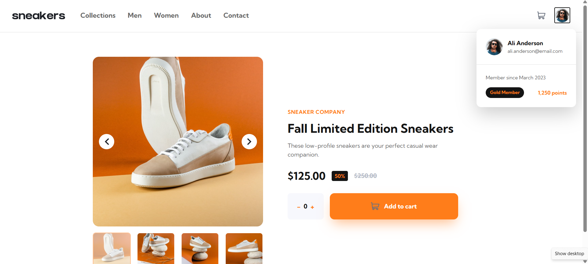
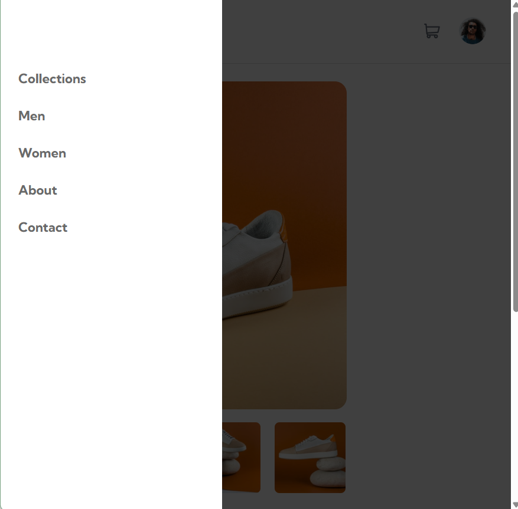

# Frontend Mentor - E-commerce Product Page

## 📋 Overview

A responsive e-commerce product page built as part of a [Frontend Mentor](https://www.frontendmentor.io) challenge. Users can browse a product image gallery, adjust quantity, and add items to a cart — with additional custom features like a profile dropdown and loyalty info.

## ✨ Features

- Responsive layout (mobile-first, desktop breakpoint at 768px)
- Interactive image gallery with thumbnail navigation and lightbox (desktop)
- Quantity selector with add-to-cart functionality
- Cart widget with item summary and delete option
- Mobile hamburger menu
- **Custom addition:** Profile dropdown showing user info and loyalty status

## 🛠️ Built With

- Semantic HTML5
- CSS3 (Flexbox, custom properties, mobile-first responsive design)
- Vanilla JavaScript (DOM manipulation, event handling)

## 💡 What I Learned

- Handling shared classes between the main gallery and lightbox (using modulo for index syncing)
- Managing multiple toggle-able UI components (nav, cart, profile dropdown) with a consistent open/close pattern
- Reinforced my understanding of event delegation and DOM traversal (`.contains()`) for closing dropdowns on outside clicks

## 🎯 Why I Chose This Project

As a Business Administration student exploring frontend development, I chose this challenge because product pages are central to e-commerce and consumer behavior — a topic directly relevant to my field of study.

## 📸 Screenshots

## 👤 Author

- Portfolio: [your-portfolio-link]
- GitHub: [@yourusername]

